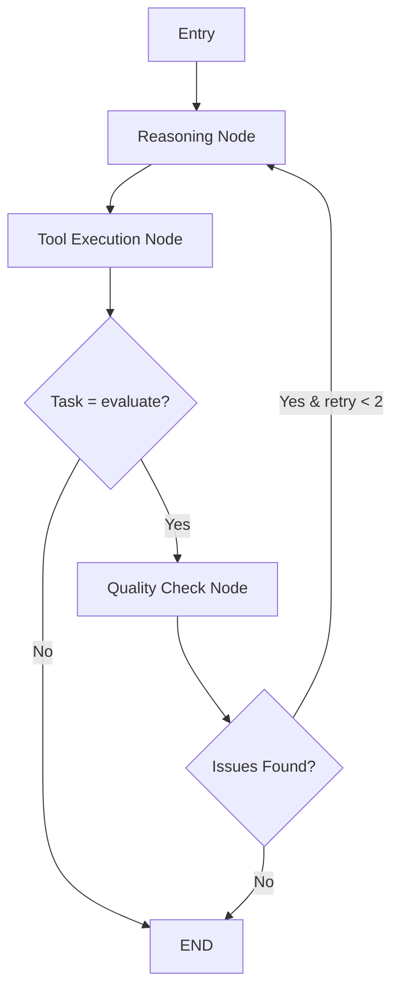

# 🎓 Exam Evaluator - AI-Powered Assessment System

Modern, agentic AI-based exam evaluation system. Provides automatic scoring, detailed feedback, and performance analysis using LangGraph and Google Gemini.

[](https://www.python.org/)
[](https://fastapi.tiangolo.com/)
[](https://www.langchain.com/)
[](https://langchain-ai.github.io/langgraph/)
[](https://nextjs.org/)

---

## 🚀 Features

### 🤖 Agentic AI Architecture
- **Multi-step Reasoning**: Iterative thinking process with ReAct pattern
- **Self-Correction**: Automatic correction with quality control (max 2 retries)
- **Confidence Scores**: Reliability score (0-1) for each evaluation
- **Tool Call Logging**: Detailed logging of all AI operations
- **Human Review Flagging**: Low confidence → manual review recommendation

### 📄 Multi-Document Processing
- **Answer Key Parsing**: Question-answer extraction from PDF
- **Student Answer Extraction**: Automatic reading of student responses
- **Structured Output**: Type-safe results with Pydantic

### 🎯 AI-Driven Evaluation
- **Question-Level Scoring**: Individual scoring for each question (0-10)
- **Turkish Feedback**: Detailed explanations in Turkish
- **Strengths & Weaknesses**: Analysis of strong/weak points
- **Reasoning Transparency**: Show AI's decision-making process

### 💬 Follow-up Q&A
- **Context-Aware Chat**: Conversation about student performance
- **Chat History**: Remember past conversations
- **Multi-turn Conversations**: Natural dialogue flow

### ⚡ Real-time Updates
- **SSE Streaming**: Live progress updates
- **Progress Tracking**: Detailed percentage indicators
- **Async Processing**: Background operations with Celery

---

## 🏗️ Architecture

### Backend Stack

```
FastAPI + Celery + PostgreSQL + Redis + RabbitMQ + LangGraph + Gemini
```

**Modular Structure:**
```
backend/
├── auth_service/           # Authentication service
│   ├── api/v1/auth/        # Auth endpoints
│   └── core/services/      # Auth business logic
│
├── content_service/        # Main evaluation service
│   ├── api/v1/content/     # Content endpoints
│   │   ├── router.py           # API routes (170 lines)
│   │   ├── schemas.py          # Pydantic schemas
│   │   ├── dependencies.py     # Auth & service injection
│   │   └── sse_helpers.py      # SSE streaming utilities
│   │
│   ├── core/
│   │   ├── agents/         # 🤖 Agentic AI (LangGraph)
│   │   │   ├── exam_agent.py    # Main agent interface
│   │   │   ├── models.py        # Pydantic schemas
│   │   │   ├── state.py         # Agent state management
│   │   │   ├── tools.py         # LangChain tools
│   │   │   ├── nodes.py         # Agent nodes (reasoning, execution, QC)
│   │   │   └── workflow.py      # LangGraph workflow
│   │   │
│   │   ├── services/       # Business logic
│   │   │   └── service.py       # Content service
│   │   │
│   │   └── worker/         # Celery tasks
│   │       ├── tasks.py         # Background tasks
│   │       ├── config.py        # Celery configuration
│   │       └── helpers.py       # Task utilities
│
└── libs/                   # Shared libraries
    ├── models/             # SQLAlchemy models
    ├── cache/              # Redis utilities
    ├── db/                 # Database configuration
    ├── exceptions/         # Error handling
    └── service/            # Shared services
```

### Frontend Stack

```
Next.js 15 + TypeScript + Tailwind CSS + Zustand
```

### Database Schema

**Evaluations** (Exams)
```sql
- evaluation_id (PK)
- exam_title
- answer_key_data (JSONB)
- status (pending, parsing, completed, failed)
- progress_percentage
```

**StudentResponse** (Student Answers)
```sql
- id (PK)
- evaluation_id (FK)
- student_name
- total_score / max_score / percentage
- strengths / weaknesses (JSON)
- needs_review (bool)  # Low confidence flag
```

**QuestionResponse** (Question-level)
```sql
- id (PK)
- student_response_id (FK)
- question_number
- student_answer / expected_answer
- score / max_score
- feedback
- confidence (float)  # NEW!
- reasoning (text)     # NEW!
```

**FollowUpQuestion** (Chat)
```sql
- id (PK)
- student_response_id (FK)
- question / answer
- context (JSONB)
```

---

## 🎯 Agentic Workflow

### LangGraph State Machine



### Agent State

```python
AgentState:
  - task: str                    # Current task
  - pdf_text: str                # Input data
  - context: Dict                # Additional context

  # Reasoning
  - thoughts: List[str]          # Agent's thinking
  - actions: List[str]           # Actions taken
  - observations: List[str]      # Results observed

  # Quality Control
  - quality_checks: List[Dict]   # Check results
  - retry_count: int             # Retry attempts
  - needs_review: bool           # Human review flag

  # Metadata
  - confidence_scores: List[float]
  - tool_call_logs: List[Dict]   # Tool execution logs
```

### Tools (LangChain)

1. **parse_answer_key_tool**: PDF → Structured Q&A
2. **parse_student_answer_tool**: PDF → Student answers
3. **evaluate_answer_tool**: Scoring + feedback + confidence
4. **quality_check_tool**: Self-correction validation
5. **analyze_performance_tool**: Strengths/weaknesses extraction

---

## 🔧 Installation

### Requirements

- Docker & Docker Compose
- Python 3.13+
- Node.js 18+
- Google Gemini API Key

### 1. Environment Variables

Create `.env` file:

```bash
# Database
POSTGRES_DB=postgres
POSTGRES_USER=postgres
POSTGRES_PASSWORD=your_password
POSTGRES_HOST=postgres
POSTGRES_PORT=5432

# Redis
REDIS_HOST=redis
REDIS_PORT=6379
REDIS_PASSWORD=redis_password_123
REDIS_TTL=3600
REDIS_PREFIX=exam_evaluator
FERNET_KEY=your_fernet_encryption_key

# RabbitMQ
RABBITMQ_USER=rabbitmq
RABBITMQ_PASS=rabbitmq_password_123
RABBITMQ_HOST=rabbitmq
RABBITMQ_PORT=5672

# Celery Worker
CONTENT_QUEUE_NAME=content_queue
CONTENT_WORKER_NAME=content_worker

# JWT
JWT_SECRET_KEY=your-super-secret-jwt-key-change-in-production
JWT_ALGORITHM=HS256
JWT_ACCESS_TOKEN_EXPIRE_MINUTES=1440

# Gemini API
GEMINI_API_KEY=your_gemini_api_key_here

# Environment
ENV_NAME=DEVELOPMENT
DEBUG=true

# Sentry (Optional)
SENTRY_ENABLED=false
SENTRY_DSN=
SENTRY_ENVIRONMENT=development
```

### 2. Start with Docker

```bash
# Build all containers
make build

# Start all services
make up

# View logs
make logs

# Stop services
make down
```

### 3. Run Migrations

```bash
# Apply migrations
make migrate

# Create new migration
make makemigrations

# View migration history
make showmigrations
```

### 4. Access Points

- **Frontend**: http://localhost:3000
- **Content API**: http://localhost:8001
- **Auth API**: http://localhost:8004
- **API Docs (Content)**: http://localhost:8001/docs
- **API Docs (Auth)**: http://localhost:8004/docs
- **RabbitMQ Management**: http://localhost:15672 (guest/guest)
- **Flower (Celery Monitor)**: http://localhost:5555
- **PgAdmin**: http://localhost:80

---

## 📖 API Usage

### 1. User Registration

```bash
POST /api/v1/auth/register
Content-Type: application/json

{
  "email": "user@example.com",
  "password": "StrongPass123!",
  "first_name": "John",
  "last_name": "Doe"
}

Response:
{
  "id": 1,
  "email": "user@example.com",
  "first_name": "John",
  "last_name": "Doe"
}
```

### 2. Login

```bash
POST /api/v1/auth/login
Content-Type: application/json

{
  "email": "user@example.com",
  "password": "StrongPass123!"
}

Response:
{
  "access_token": "eyJhbGciOiJIUzI1NiIsInR5cCI6IkpXVCJ9...",
  "token_type": "bearer",
  "expires_in": 86400,
  "user": {
    "id": 1,
    "email": "user@example.com",
    "first_name": "John",
    "last_name": "Doe"
  }
}
```

### 3. Upload Answer Key

```bash
POST /api/v1/exam/upload-answer-key
Headers:
  Authorization: Bearer {token}
Content-Type: multipart/form-data

Form Data:
  exam_title: "Biology Midterm"
  answer_key: answer_key.pdf

Response:
{
  "evaluation_id": "eval_abc123def456",
  "status": "pending",
  "message": "Answer key uploaded successfully. Processing in background.",
  "total_questions": null,
  "max_possible_score": null
}
```

### 4. Upload Student Answer Sheet

```bash
POST /api/v1/exam/{evaluation_id}/upload-student-sheet
Headers:
  Authorization: Bearer {token}
Content-Type: multipart/form-data

Form Data:
  student_name: "Alice Johnson"
  student_sheet: student_answers.pdf

Response:
{
  "student_response_id": 1,
  "evaluation_id": "eval_abc123def456",
  "student_name": "Alice Johnson",
  "status": "pending",
  "message": "Student answer sheet uploaded successfully. Processing in background."
}
```

### 5. Get Exam Details

```bash
GET /api/v1/exam/{evaluation_id}
Headers:
  Authorization: Bearer {token}

Response:
{
  "evaluation_id": "eval_abc123def456",
  "exam_title": "Biology Midterm",
  "status": "completed",
  "progress_percentage": 100.0,
  "current_message": "Answer key successfully processed! 5 questions found.",
  "total_questions": 5,
  "max_possible_score": 50.0,
  "questions": [
    {
      "number": 1,
      "question_text": "What is photosynthesis?",
      "expected_answer": "Photosynthesis is the process...",
      "max_score": 10.0,
      "keywords": ["photosynthesis", "chlorophyll", "light energy"]
    }
  ],
  "created_at": "2025-01-15T10:30:00",
  "updated_at": "2025-01-15T10:32:00"
}
```

### 6. Get Student List

```bash
GET /api/v1/exam/{evaluation_id}/students
Headers:
  Authorization: Bearer {token}

Response:
[
  {
    "student_response_id": 1,
    "student_id": "student_a1b2c3d4",
    "student_name": "Alice Johnson",
    "total_score": 42.5,
    "max_score": 50.0,
    "percentage": 85.0,
    "status": "completed",
    "has_questions": true,
    "created_at": "2025-01-15T11:00:00"
  },
  {
    "student_response_id": 2,
    "student_name": "Bob Smith",
    "total_score": 0.0,
    "max_score": 50.0,
    "percentage": 0.0,
    "status": "processing",
    "has_questions": true,
    "created_at": "2025-01-15T11:05:00"
  }
]
```

### 7. Get Student Details

```bash
GET /api/v1/exam/student/{student_response_id}
Headers:
  Authorization: Bearer {token}

Response:
{
  "student_response_id": 1,
  "student_id": "student_a1b2c3d4",
  "student_name": "Alice Johnson",
  "total_score": 42.5,
  "max_score": 50.0,
  "percentage": 85.0,
  "summary": null,
  "strengths": [
    "Provides detailed explanations",
    "Uses relevant examples"
  ],
  "weaknesses": [
    "Missing historical context",
    "Brief answers in some questions"
  ],
  "topic_gaps": [],
  "questions": [
    {
      "question_number": 1,
      "question_text": "What is photosynthesis?",
      "expected_answer": "Photosynthesis is the process by which green plants...",
      "student_answer": "Photosynthesis converts light energy to chemical energy...",
      "score": 8.5,
      "max_score": 10.0,
      "feedback": "Well explained. Key concepts are correct.",
      "is_correct": true,
      "confidence": 0.9,
      "reasoning": "Core concepts are accurate"
    }
  ],
  "created_at": "2025-01-15T11:00:00",
  "updated_at": "2025-01-15T11:03:00"
}
```

### 8. Chat (Follow-up Questions)

```bash
POST /api/v1/exam/student/{student_response_id}/chat
Headers:
  Authorization: Bearer {token}
Content-Type: application/json

{
  "question": "What is the student's biggest weakness?",
  "chat_history": [
    {"role": "user", "content": "How is the overall performance?"},
    {"role": "assistant", "content": "Quite good. The student scored 85%..."}
  ]
}

Response:
{
  "answer": "The student's biggest weakness is ignoring historical context in answers..."
}
```

### 9. SSE Progress Stream

```javascript
// Frontend - Real-time progress tracking
const token = localStorage.getItem('token');
const eventSource = new EventSource(
  `/api/v1/exam/${evaluationId}/progress-stream?token=${token}`
);

eventSource.onmessage = (event) => {
  const data = JSON.parse(event.data);
  console.log(`Progress: ${data.percentage}% - ${data.message}`);

  if (data.type === 'done') {
    console.log('Processing completed!');
    eventSource.close();
  }
};

eventSource.onerror = (error) => {
  console.error('SSE Error:', error);
  eventSource.close();
};

// Example message:
// {
//   percentage: 45,
//   message: "Evaluating question 3/5",
//   status: "processing",
//   total_questions: 5,
//   evaluated_questions: 3
// }
```

---

## 🧪 Testing

### Unit Tests

```bash
# Run all tests
docker-compose run --rm content-service pytest

# With coverage
docker-compose run --rm content-service pytest --cov=content_service

# Specific test file
docker-compose run --rm content-service pytest tests/test_agents.py

# Verbose output
docker-compose run --rm content-service pytest -v
```

### Manual Testing Flow

1. **Register User**: `POST /api/v1/auth/register`
2. **Login**: `POST /api/v1/auth/login` → Get JWT token
3. **Upload Answer Key**: `POST /api/v1/exam/upload-answer-key`
4. **Monitor Progress**: SSE stream or poll `GET /api/v1/exam/{id}`
5. **Upload Student Sheet**: `POST /api/v1/exam/{id}/upload-student-sheet`
6. **View Results**: `GET /api/v1/exam/student/{id}`
7. **Chat**: `POST /api/v1/exam/student/{id}/chat`

---

## 🛠️ Development

### Makefile Commands

```bash
# Docker Operations
make build          # Build all containers
make up             # Start all services in detached mode
make down           # Stop and remove all containers
make restart        # Restart all services
make stop           # Stop services without removing
make ps             # Show running containers

# Logs
make logs           # View logs from all services
make log            # View logs from specific service (interactive)

# Database
make migrate        # Run database migrations
make makemigrations # Create new migration
make showmigrations # Show migration history
make downgrade      # Rollback last migration

# Development Tools
make service-shell  # Open Python shell in service
make bash           # Open bash in container

# Cleanup
make clean          # Clean up Docker resources (volumes, networks)
```

### Code Quality

```bash
# Linting with ruff
ruff check backend/

# Auto-fix issues
ruff check --fix backend/

# Format code
ruff format backend/

# Type checking with mypy
mypy backend/

# Pre-commit hooks
pre-commit install
pre-commit run --all-files
```

### Project Structure Conventions

- **API Layer**: Thin routes, delegate to services
- **Service Layer**: Business logic, database operations
- **Agent Layer**: AI operations, LangGraph workflows
- **Worker Layer**: Background tasks, Celery jobs
- **Models**: Database models (SQLAlchemy)
- **Schemas**: API contracts (Pydantic)

---

## 🔒 Security

### Implemented Security Features

- **JWT Authentication**: Token-based authentication with expiration
- **Password Hashing**: Argon2 with salt (industry standard)
- **Rate Limiting**: FastAPI Limiter with Redis backend
- **CORS**: Configured for specific frontend origin
- **Input Validation**: Pydantic schemas for all inputs
- **SQL Injection Protection**: SQLAlchemy ORM (no raw SQL)
- **File Upload Validation**: PDF-only with size limits
- **Error Handling**: No sensitive data in error messages

### Security Best Practices

```python
# JWT Token Example
headers = {
    'Authorization': f'Bearer {token}'
}

# Tokens expire after 24 hours (configurable)
JWT_ACCESS_TOKEN_EXPIRE_MINUTES=1440

# Rate limiting (10 requests per minute per IP)
@app.get("/api/protected")
@limiter.limit("10/minute")
async def protected_route():
    ...
```

---

## 📊 Monitoring

### Flower (Celery Monitor)

**URL**: http://localhost:5555

Features:
- Real-time task monitoring
- Worker health status
- Task history and statistics
- Retry and revoke tasks
- Performance metrics

### Application Logs

```bash
# View all logs
make logs

# View specific service
docker-compose logs -f content-service

# View last 100 lines
docker-compose logs --tail=100 content-worker
```

### Sentry Integration (Optional)

```bash
# Enable in .env
SENTRY_ENABLED=true
SENTRY_DSN=https://your-sentry-dsn@sentry.io/project-id
SENTRY_ENVIRONMENT=production

# Automatic error tracking
# All exceptions are automatically sent to Sentry
```

---

## 🚧 Roadmap

### Completed ✅
- [x] Multi-document PDF parsing (answer keys & student sheets)
- [x] AI-driven evaluation with Google Gemini
- [x] Agentic architecture with LangGraph
- [x] Self-correction mechanism with quality checks
- [x] Confidence scores for all evaluations
- [x] Real-time SSE streaming for progress
- [x] Follow-up Q&A chat with context
- [x] Strengths/weaknesses analysis
- [x] Tool call logging and transparency
- [x] Modular codebase structure
- [x] Comprehensive API documentation

### In Progress 🔨
- [ ] Unit and integration tests
- [ ] Performance optimization (batch processing)
- [ ] Enhanced error recovery

### Planned 🔜
- [ ] **Topic Gaps Implementation**: Identify missing knowledge areas (model field exists)
- [ ] **Multi-Agent Collaboration**: Separate Evaluator and Reviewer agents
- [ ] **Batch Processing**: Parallel evaluation of multiple students
- [ ] **Comparative Analytics**: Student rankings, class averages, percentiles
- [ ] **Image/Diagram Recognition**: OCR for diagrams and images in PDFs
- [ ] **Handwriting Recognition**: Support for handwritten exams
- [ ] **Export Features**: PDF reports, Excel spreadsheets
- [ ] **Email Notifications**: Alerts for completed evaluations
- [ ] **Admin Dashboard**: Teacher analytics and insights
- [ ] **Multi-language Support**: Extend beyond Turkish feedback
- [ ] **Custom Rubrics**: Teacher-defined scoring criteria
- [ ] **Plagiarism Detection**: Compare student answers

---

## 🤝 Contributing

We welcome contributions! Please follow these steps:

1. **Fork** the repository
2. **Create** a feature branch (`git checkout -b feature/amazing-feature`)
3. **Commit** your changes (`git commit -m 'Add amazing feature'`)
4. **Push** to the branch (`git push origin feature/amazing-feature`)
5. **Open** a Pull Request

### Contribution Guidelines

- Follow existing code style (ruff format)
- Add tests for new features
- Update documentation (README, docstrings)
- Keep commits atomic and well-described
- Ensure all tests pass before PR

---

## 📝 License

This project is licensed under the **MIT License** - see the [LICENSE](LICENSE) file for details.

---

## 👥 Authors

- **Ali Yaman** - *Initial Development & Architecture*

---

## 🙏 Acknowledgments

- **[LangChain](https://langchain.com/)** - Agentic framework and tools
- **[LangGraph](https://langchain-ai.github.io/langgraph/)** - Stateful agent workflows
- **[Google Gemini](https://ai.google.dev/)** - Large language model provider
- **[FastAPI](https://fastapi.tiangolo.com/)** - Modern Python web framework
- **[Next.js](https://nextjs.org/)** - React framework for frontend
- **[Celery](https://docs.celeryproject.org/)** - Distributed task queue
- **[PostgreSQL](https://www.postgresql.org/)** - Robust relational database
- **[Redis](https://redis.io/)** - In-memory data store for caching
- **[RabbitMQ](https://www.rabbitmq.com/)** - Message broker

---

## 📧 Contact

For questions, feedback, or support:

- **Email**: your-email@example.com
- **GitHub Issues**: [Create an issue](https://github.com/AliYmn/exam-evaluator/issues)
- **Discussions**: [GitHub Discussions](https://github.com/AliYmn/exam-evaluator/discussions)

---

## 📈 Project Stats

- **Language**: Python (Backend), TypeScript (Frontend)
- **Architecture**: Microservices (Auth + Content)
- **AI Framework**: LangGraph + LangChain
- **LLM**: Google Gemini 2.0 Flash
- **Code Quality**: Ruff linting, Type hints
- **Testing**: Pytest, Coverage
- **Deployment**: Docker Compose
- **Documentation**: Comprehensive README, API docs

---

**Built with ❤️ and 🤖 AI**

*Revolutionizing exam evaluation with intelligent automation*
