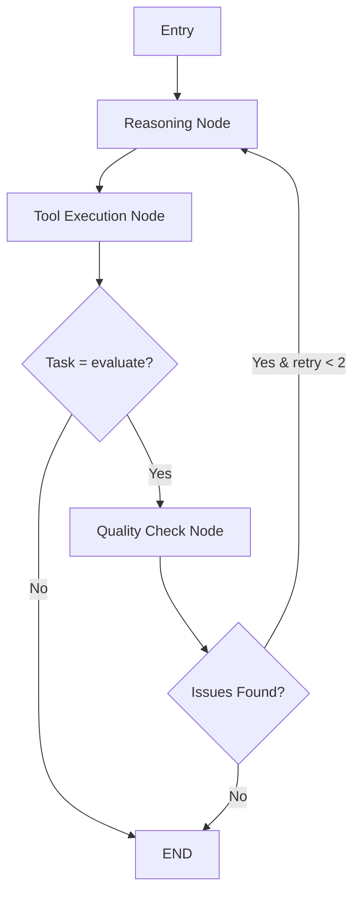

# 🎓 Exam Evaluator - AI-Powered Assessment System

Modern, agentic AI tabanlı sınav değerlendirme sistemi. LangGraph ve Google Gemini kullanarak otomatik puanlama, detaylı feedback ve performans analizi sunar.

[](https://www.python.org/)
[](https://fastapi.tiangolo.com/)
[](https://www.langchain.com/)
[](https://nextjs.org/)

---

## 🚀 Özellikler

### 🤖 Agentic AI Architecture
- **Multi-step Reasoning**: ReAct pattern ile iterative düşünce süreci
- **Self-Correction**: Kalite kontrolü ile otomatik düzeltme (max 2 retry)
- **Confidence Scores**: Her değerlendirmede güvenilirlik skoru (0-1)
- **Tool Call Logging**: Tüm AI işlemlerinin detaylı kaydı
- **Human Review Flagging**: Düşük güven → manuel kontrol önerisi

### 📄 Multi-Document Processing
- **Answer Key Parsing**: PDF'den soru-cevap çıkarımı
- **Student Answer Extraction**: Öğrenci cevaplarını otomatik okuma
- **Structured Output**: Pydantic ile tip güvenli sonuçlar

### 🎯 AI-Driven Evaluation
- **Question-Level Scoring**: Her soru için ayrı puanlama (0-10)
- **Turkish Feedback**: Detaylı Türkçe açıklamalar
- **Strengths & Weaknesses**: Güçlü/zayıf yön analizi
- **Reasoning Transparency**: AI'ın karar verme sürecini göster

### 💬 Follow-up Q&A
- **Context-Aware Chat**: Öğrenci performansı hakkında sohbet
- **Chat History**: Geçmiş konuşmaları hatırlama
- **Multi-turn Conversations**: Doğal sohbet akışı

### ⚡ Real-time Updates
- **SSE Streaming**: Canlı ilerleme güncellemeleri
- **Progress Tracking**: Detaylı yüzdelik göstergeler
- **Async Processing**: Celery ile arka plan işlemleri

---

## 🏗️ Mimari

### Backend Stack

```
FastAPI + Celery + PostgreSQL + Redis + RabbitMQ + LangGraph + Gemini
```

**Modüler Yapı:**
```
backend/
├── auth_service/           # Kimlik doğrulama servisi
│   ├── api/v1/auth/        # Auth endpoints
│   └── core/services/      # Auth business logic
│
├── content_service/        # Ana değerlendirme servisi
│   ├── api/v1/content/     # Content endpoints
│   ├── core/
│   │   ├── agents/         # 🤖 Agentic AI (LangGraph)
│   │   │   ├── exam_agent.py    # Main agent interface
│   │   │   ├── models.py        # Pydantic schemas
│   │   │   ├── state.py         # Agent state management
│   │   │   ├── tools.py         # LangChain tools
│   │   │   ├── nodes.py         # Agent nodes (reasoning, execution, quality check)
│   │   │   └── workflow.py      # LangGraph workflow
│   │   ├── services/       # Business logic
│   │   └── worker/         # Celery tasks
│
└── libs/                   # Paylaşılan kütüphaneler
    ├── models/             # SQLAlchemy models
    ├── cache/              # Redis utilities
    ├── db/                 # Database configuration
    ├── exceptions/         # Error handling
    └── service/            # Shared services
```

### Frontend Stack

```
Next.js 15 + TypeScript + Tailwind CSS + Zustand
```

### Database Schema

**Evaluations** (Sınavlar)
```sql
- evaluation_id (PK)
- exam_title
- answer_key_data (JSONB)
- status (pending, parsing, completed, failed)
- progress_percentage
```

**StudentResponse** (Öğrenci Cevapları)
```sql
- id (PK)
- evaluation_id (FK)
- student_name
- total_score / max_score / percentage
- strengths / weaknesses (JSON)
- needs_review (bool)  # Low confidence flag
```

**QuestionResponse** (Soru Bazlı)
```sql
- id (PK)
- student_response_id (FK)
- question_number
- student_answer / expected_answer
- score / max_score
- feedback
- confidence (float)  # NEW!
- reasoning (text)     # NEW!
```

**FollowUpQuestion** (Chat)
```sql
- id (PK)
- student_response_id (FK)
- question / answer
- context (JSONB)
```

---

## 🎯 Agentic Workflow

### LangGraph State Machine



### Agent State

```python
AgentState:
  - task: str                    # Current task
  - pdf_text: str                # Input data
  - context: Dict                # Additional context

  # Reasoning
  - thoughts: List[str]          # Agent's thinking
  - actions: List[str]           # Actions taken
  - observations: List[str]      # Results observed

  # Quality Control
  - quality_checks: List[Dict]   # Check results
  - retry_count: int             # Retry attempts
  - needs_review: bool           # Human review flag

  # Metadata
  - confidence_scores: List[float]
  - tool_call_logs: List[Dict]   # Tool execution logs
```

### Tools (LangChain)

1. **parse_answer_key_tool**: PDF → Structured Q&A
2. **parse_student_answer_tool**: PDF → Student answers
3. **evaluate_answer_tool**: Scoring + feedback + confidence
4. **quality_check_tool**: Self-correction validation
5. **analyze_performance_tool**: Strengths/weaknesses extraction

---

## 🔧 Kurulum

### Gereksinimler

- Docker & Docker Compose
- Python 3.13+
- Node.js 18+
- Google Gemini API Key

### 1. Ortam Değişkenlerini Ayarla

`.env` dosyası oluşturun:

```bash
# Database
POSTGRES_DB=postgres
POSTGRES_USER=postgres
POSTGRES_PASSWORD=your_password
POSTGRES_HOST=postgres
POSTGRES_PORT=5432

# Redis
REDIS_HOST=redis
REDIS_PORT=6379
REDIS_PASSWORD=redis_password_123

# RabbitMQ
RABBITMQ_USER=rabbitmq
RABBITMQ_PASS=rabbitmq_password_123
RABBITMQ_PORT=5672

# JWT
JWT_SECRET_KEY=your-super-secret-jwt-key-change-in-production
JWT_ALGORITHM=HS256
JWT_ACCESS_TOKEN_EXPIRE_MINUTES=1440

# Gemini API
GEMINI_API_KEY=your_gemini_api_key_here

# Environment
ENV_NAME=DEVELOPMENT
DEBUG=true
```

### 2. Docker ile Başlat

```bash
# Build
make build

# Start all services
make up

# View logs
make logs

# Stop
make down
```

### 3. Migrations

```bash
# Run migrations
make migrate

# Create new migration
make makemigrations
```

### 4. Access Points

- **Frontend**: http://localhost:3000
- **Content API**: http://localhost:8001
- **Auth API**: http://localhost:8004
- **RabbitMQ**: http://localhost:15672
- **Flower (Celery)**: http://localhost:5555
- **PgAdmin**: http://localhost:80

---

## 📖 API Kullanımı

### 1. Kullanıcı Kaydı

```bash
POST /api/v1/auth/register
{
  "email": "user@example.com",
  "password": "StrongPass123!",
  "first_name": "Ali",
  "last_name": "Yaman"
}
```

### 2. Login

```bash
POST /api/v1/auth/login
{
  "email": "user@example.com",
  "password": "StrongPass123!"
}

Response:
{
  "access_token": "eyJ...",
  "token_type": "bearer",
  "user": {...}
}
```

### 3. Cevap Anahtarı Yükle

```bash
POST /api/v1/exam/upload
Headers: Authorization: Bearer {token}
Content-Type: multipart/form-data

Form Data:
- exam_title: "Biyoloji Vize"
- answer_key_file: answer_key.pdf
```

### 4. Öğrenci Cevap Kağıdı Yükle

```bash
POST /api/v1/exam/{evaluation_id}/upload-student-sheet
Headers: Authorization: Bearer {token}
Content-Type: multipart/form-data

Form Data:
- student_name: "Ahmet Yılmaz"
- student_sheet: student_answers.pdf
```

### 5. Sınav Detayları

```bash
GET /api/v1/exam/{evaluation_id}
Headers: Authorization: Bearer {token}

Response:
{
  "evaluation_id": "eval_abc123",
  "exam_title": "Biyoloji Vize",
  "status": "completed",
  "answer_key_data": {
    "questions": [...],
    "total_questions": 5,
    "max_possible_score": 50
  },
  "total_students": 3,
  "progress_percentage": 100
}
```

### 6. Öğrenci Listesi

```bash
GET /api/v1/exam/{evaluation_id}/students
Headers: Authorization: Bearer {token}

Response:
[
  {
    "id": 1,
    "student_name": "Ahmet Yılmaz",
    "total_score": 42.5,
    "max_score": 50,
    "percentage": 85.0,
    "status": "completed",
    "has_questions": true,
    "needs_review": false  # Low confidence flag
  }
]
```

### 7. Öğrenci Detayı

```bash
GET /api/v1/exam/student/{student_response_id}
Headers: Authorization: Bearer {token}

Response:
{
  "student_id": 1,
  "student_name": "Ahmet Yılmaz",
  "total_score": 42.5,
  "max_score": 50,
  "percentage": 85.0,
  "strengths": ["Detaylı açıklama yapıyor", "Örnekler veriyor"],
  "weaknesses": ["Tarihsel bağlamı eksik"],
  "needs_review": false,
  "avg_confidence": 0.87,  # NEW!
  "questions": [
    {
      "question_number": 1,
      "question_text": "Fotosentez nedir?",
      "expected_answer": "...",
      "student_answer": "...",
      "score": 8.5,
      "max_score": 10,
      "feedback": "İyi açıklanmış...",
      "is_correct": true,
      "confidence": 0.9,      # NEW!
      "reasoning": "Temel kavramları doğru"  # NEW!
    }
  ],
  "_agent_trace": {  # NEW! Transparency
    "thoughts": ["Need to evaluate...", "Quality check passed"],
    "observations": ["Evaluated 5 questions", "Avg confidence: 0.87"],
    "tool_calls": [
      {"tool": "evaluate_answer_tool", "duration": 2.3, "confidence": 0.9}
    ]
  }
}
```

### 8. Chat (Follow-up Questions)

```bash
POST /api/v1/exam/student/{student_response_id}/chat
Headers: Authorization: Bearer {token}
{
  "question": "Öğrencinin en büyük eksikliği nedir?",
  "chat_history": [
    {"role": "user", "content": "Genel performansı nasıl?"},
    {"role": "assistant", "content": "Oldukça iyi..."}
  ]
}

Response:
{
  "answer": "Öğrencinin en büyük eksikliği tarihsel bağlamı göz ardı etmesi..."
}
```

### 9. SSE Progress Stream

```javascript
// Frontend - Real-time progress
const eventSource = new EventSource(
  `/api/v1/exam/${evaluationId}/progress-stream?token=${token}`
);

eventSource.onmessage = (event) => {
  const data = JSON.parse(event.data);
  console.log(data.percentage, data.message);
  // { percentage: 45, message: "Evaluating question 3/5", status: "processing" }
};
```

---

## 🧪 Test

### Unit Tests

```bash
# Run all tests
docker-compose run --rm content-service pytest

# With coverage
docker-compose run --rm content-service pytest --cov=content_service
```

### Manual Testing

1. **Upload Answer Key**: `POST /api/v1/exam/upload`
2. **Check Progress**: SSE stream
3. **Upload Student Sheet**: `POST /api/v1/exam/{id}/upload-student-sheet`
4. **View Results**: `GET /api/v1/exam/student/{id}`
5. **Chat**: `POST /api/v1/exam/student/{id}/chat`

---

## 🛠️ Development

### Makefile Commands

```bash
# Docker
make build          # Build all containers
make up             # Start services
make down           # Stop and remove
make restart        # Restart all
make ps             # Show running containers

# Logs
make logs           # View all logs
make log            # View specific service log

# Database
make migrate        # Run migrations
make makemigrations # Create new migration
make showmigrations # Show migration history
make downgrade      # Rollback migration

# Shell
make service-shell  # Open Python shell in service
make bash           # Open bash in container

# Cleanup
make clean          # Clean up Docker resources
```

### Code Quality

```bash
# Linting (ruff)
ruff check backend/

# Format
ruff format backend/

# Type checking
mypy backend/
```

---

## 🔒 Güvenlik

- **JWT Authentication**: Token-based auth
- **Password Hashing**: Argon2 with salt
- **Rate Limiting**: FastAPI Limiter (Redis)
- **CORS**: Configured for frontend origin
- **Input Validation**: Pydantic schemas
- **SQL Injection**: SQLAlchemy ORM protection

---

## 📊 Monitoring

### Flower (Celery Monitor)

http://localhost:5555

- Task status tracking
- Worker health
- Task history

### Sentry (Optional)

```python
# libs/settings.py
SENTRY_ENABLED=true
SENTRY_DSN=your_sentry_dsn
```

---

## 🚧 Roadmap

### Completed ✅
- [x] Multi-document PDF parsing
- [x] AI-driven evaluation with Gemini
- [x] Agentic architecture (LangGraph)
- [x] Self-correction mechanism
- [x] Confidence scores
- [x] Real-time SSE streaming
- [x] Follow-up Q&A chat
- [x] Strengths/weaknesses analysis
- [x] Tool call logging

### Planned 🔜
- [ ] Topic gaps implementation (model field exists)
- [ ] Multi-agent collaboration (Evaluator + Reviewer)
- [ ] Batch processing (parallel evaluation)
- [ ] Comparative analytics (student rankings)
- [ ] Image/diagram recognition
- [ ] Handwriting recognition
- [ ] Export to PDF/Excel
- [ ] Email notifications
- [ ] Admin dashboard

---

## 🤝 Contributing

1. Fork the repository
2. Create feature branch (`git checkout -b feature/amazing-feature`)
3. Commit changes (`git commit -m 'Add amazing feature'`)
4. Push to branch (`git push origin feature/amazing-feature`)
5. Open Pull Request

---

## 📝 License

This project is licensed under the MIT License - see the [LICENSE](LICENSE) file for details.

---

## 👥 Authors

- **Ali Yaman** - *Initial work*

---

## 🙏 Acknowledgments

- **LangChain** - Agentic framework
- **LangGraph** - Stateful agent workflows
- **Google Gemini** - LLM provider
- **FastAPI** - Modern Python web framework
- **Next.js** - React framework

---

## 📧 İletişim

Sorularınız için:
- Email: your-email@example.com
- GitHub Issues: [Create an issue](https://github.com/yourusername/exam-evaluator/issues)

---

**Made with ❤️ and 🤖 AI**
